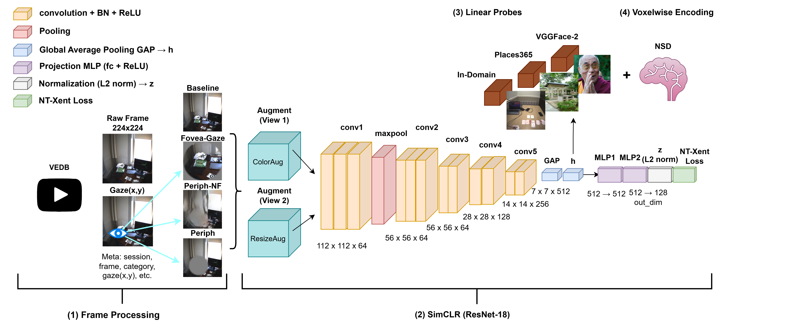

# Eccentricity-Constrained CNN Training Reveals Adaptive Information Coding Around the Visual Field

Code, analysis notebooks, metadata, and reproducibility materials associated with:

**Diaz, D. M., & Henderson, M. M. (2026). _Eccentricity-Constrained CNN Training Reveals Adaptive Information Coding Around the Visual Field_. Proceedings of the 9th Conference on Cognitive Computational Neuroscience.**

- DOI: https://doi.org/10.32470/0416gfsq
- arXiv: https://arxiv.org/abs/2607.19316
- CCN 26' Contributed Talk: https://www.youtube.com/watch?v=Lb4S3FWqd2M&t=2545s

This repository contains the recovered processing, training, downstream evaluation, NSD encoding, and figure-generation code used for the project. For the model checkpoints, including detailed checkpoint specifications, training hyperparameters, architecture details, and model-loading instructions, see the associated Hugging Face collection and individual model cards. [HuggingFace collection](https://huggingface.co/collections/DM-Diaz/eccentricity-constrained-simclr-models-vedb
).

## Repository structure

```text
.
├── analysis/
│   ├── nsd/
│   └── vedb/
├── linear_probes/
│   ├── outputs/
│   ├── reference_models/
│   └── sbatch/
├── metadata/
│   └── vedb/
├── nsd/
│   └── sbatch/
├── training/
│   └── vedb_simclr/
│       ├── models/
│       └── sbatch/
└── vedb_processing/
    └── vedb/
        ├── conditions/
        ├── frame_sampling/
        ├── gaze/
        └── neurofovea/
```

## Architecture

<p align="center">
  
</p>

<p align="center">
  <em>Overview of the VEDB preprocessing, SimCLR pretraining, downstream linear probes, and voxelwise encoding workflow.</em>
</p>

### `analysis/`

Publication-facing analysis notebooks and figure-generation code.

- `analysis/vedb/` contains analyses for SimCLR training and downstream classification, including the in-domain task, VGGFace2, and Places365.
- `analysis/nsd/` contains analyses for NSD encoding-model comparisons and variance partitioning.

The notebooks in this directory were cleaned from the original working analyses to retain the code relevant to the final paper figures and tables.

### `linear_probes/`

Downstream classifier scripts for:

- the in-domain VEDB task,
- VGGFace2 identity classification,
- Places365 scene classification.

The scripts retain their original filenames and command-line structure so that they remain associated with the recovered SLURM launchers in `linear_probes/sbatch/`.

The downstream scripts support multiple stages, including exploratory fine-tuning. **The results reported in the paper use the frozen-backbone linear-probe stage only.** Fine-tuning functionality and exploratory fine-tuning runs were not part of the reported analyses.

`linear_probes/outputs/` contains small analysis artifacts used to reconstruct reported results and figures. Large model checkpoints are not stored in this repository.

### `metadata/vedb/`

Recovered VEDB manifests and related metadata used to define sampled frames, sessions, labels, and data splits.

The full Visual Experience Database is **not redistributed through this repository**.

### `nsd/`

Code used for NSD feature extraction, PCA, voxelwise encoding-model fitting, and variance-partitioning analyses, together with recovered SLURM launchers.

Large learned encoding-model arrays and other high-volume derived artifacts are stored separately from GitHub.

### `training/vedb_simclr/`

Recovered SimCLR training code for the four VEDB conditions:

- Baseline
- Fovea-Gaze
- Periph
- Periph-NF

<p align="center">
  
</p>

The code is based in part on the upstream `sthalles/PyTorch-SimCLR` implementation. Original upstream license and attribution files are retained where applicable.

### `vedb_processing/vedb/`

Recovered preprocessing code for constructing the VEDB training corpus and eccentricity-constrained input conditions.

Subdirectories include:

- `gaze/` — gaze synchronization and gaze-to-video-frame mapping
- `frame_sampling/` — video frame extraction and preprocessing
- `conditions/` — Fovea-Gaze and Periph transformations
- `neurofovea/` — project-specific NeuroFovea processing used for the Periph-NF condition

## Model checkpoints

Pretrained ResNet-18 SimCLR checkpoints are hosted on Hugging Face:

VEDB Pre-trained
- Baseline: https://huggingface.co/DM-Diaz/VEDB-SimCLR-ResNet18-Baseline
- Fovea-Gaze: https://huggingface.co/DM-Diaz/VEDB-SimCLR-ResNet18-Fovea-Gaze
- Periph: https://huggingface.co/DM-Diaz/VEDB-SimCLR-ResNet18-Periph
- Periph-NF: https://huggingface.co/DM-Diaz/VEDB-SimCLR-ResNet18-Periph-NF

Non-egocentric reference models
- ImageNet-1K: https://huggingface.co/DM-Diaz/SimCLR-ResNet18-ImageNet1K
- ImageNet-100: https://huggingface.co/DM-Diaz/SimCLR-ResNet18-ImageNet100
- STL-10: https://github.com/Spijkervet/SimCLR (external pretrained reference model; checkpoint provided by Spijkervet/SimCLR and not redistributed by this project)

Collection:

https://huggingface.co/collections/DM-Diaz/eccentricity-constrained-simclr-models-vedb

NSD encoding-model artifacts are hosted separately at:

https://huggingface.co/DM-Diaz/VEDB-NSD-ResNet18-Encoding-Models

## Reproducibility notes

This repository was assembled from the original project files after publication in order to preserve the code and artifacts that were actually used during the study. As a result, some scripts retain:

- cluster-specific filesystem paths,
- historical internal condition names,
- versioned filenames,
- exploratory functionality that was not used in the reported analyses.

Users should adapt local paths and SLURM settings before rerunning the code.

Also note that there may be discrepancies between default argument values defined within scripts versus those defined in sbatch files which were used to run on CMU's [MiND Compute cluster](https://ni.cmu.edu/computing/knowledge-base/mind-cluster-nodes/)

## Data

The project uses the [**Visual Experience Database (VEDB)**](https://pmc.ncbi.nlm.nih.gov/articles/PMC11466363/) and the [**Natural Scenes Dataset (NSD)**](https://www.naturalscenesdataset.org/).

Neither full dataset is redistributed here. Users should obtain the source datasets from their respective providers and comply with the original licenses and access requirements.

## Requirements

Note that the recovered code in this repo was developed across local workstations and HPC environments rather than as a single packaged software library. Dependencies vary by stage of the pipeline.

The common dependencies include:

- Python 3
- PyTorch
- torchvision
- NumPy
- pandas
- scikit-learn
- matplotlib
- SciPy
- Jupyter
- PyTorch Lightning / Lightly for the ImageNet reference models
- SLURM for the provided HPC launch scripts

Exact environment reconstruction may require adapting package versions and filesystem paths from the original computing environment.

You will also need to download [PyTorch-SimCLR](https://github.com/sthalles/SimCLR) and [NeuroFovea](https://github.com/ArturoDeza/NeuroFovea_PyTorch/tree/main) from their respective repos.

## Citation

If you use this code or the associated checkpoints stored on huggingface, please cite:

```bibtex
@inproceedings{diaz2026eccentricity,
  author    = {Diaz, Dylan M. and Henderson, Margaret M.},
  title     = {Eccentricity-Constrained CNN Training Reveals Adaptive Information Coding Around the Visual Field},
  booktitle = {Proceedings of the 9th Conference on Cognitive Computational Neuroscience},
  address   = {New York, NY, USA},
  year      = {2026},
  doi       = {10.32470/0416gfsq}
}
```

## Licenses and third-party code

Original project code is released under the repository license (Apache-2.0).

Some files are derived from or modify third-party software, including [PyTorch-SimCLR](https://github.com/sthalles/SimCLR) and [NeuroFovea](https://github.com/ArturoDeza/NeuroFovea_PyTorch/tree/main). Those files retain their applicable upstream licenses and attribution. Dataset licenses and terms remain with the original dataset providers.

## AI Disclosure

An LLM (Claude Opus 5) was used to help draft and refine README documentation for this repository. The research code, analysis scripts, model files, and other released project artifacts were not generated by AI.

## Contact

**Dylan M. Diaz**  dylan.diaz4811@coyote.csusb.edu | dylandiaz101@yahoo.com <br>
California State University, San Bernardino (CSUSB)

**Margaret M. Henderson** mmhender@andrew.cmu.edu <br>
Carnegie Mellon University (CMU)

For questions about the paper, code, or released artifacts, please contact the authors.
